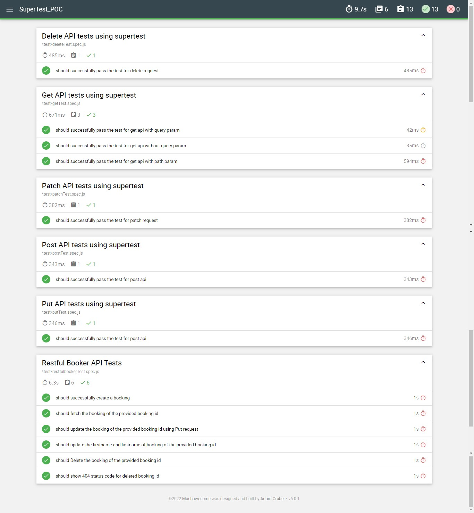

# API Testing using SuperTest, Mocha and Chai

## Don't forget to give a :star: to make the project popular.

## What is it all about?

I have been using Rest-Assured framework all the time for testing APIs with Java. But this time it was my project's demand to perform API testing in Javascript.
Being a newbie to JS, I googled for some tools and found `SuperTest`.
To introduce `SuperTest`, it is a high level abstraction of HTTP requests, making it perfect for testing APIs.
I decided to do a POC of this tool to understand it better, hence this project was created.
I thought of sharing this on github, so it helps others as well who want to learn more about this tool.
_Checkout [this][] link to learn more about `SuperTest`_

## Getting Started:

You need to have the following installed in your machine:

1. Node (Latest Version).
2. npm(Latest Version).
3. `mocha` framework is used for writing tests and `chai` for assertions, following command should help to install the required npm packages:
   `npm i -D -g supertest mocha chai mochawesome`
4. For running the tests, you need to type the command: `npm run test`. _(Check Package.json for more details)_
5. For generating the mochawesome report, run the command `npm run report` _(Check Package.json for more details.)_ It will generate and export the report in `mochawesome-report` folder from which you can open the `index.html` file to view the report.

## Talking more about the Scenarios Covered in this project:

- I have covered, `GET`, `POST`, `PUT`, `PATCH` and `DELETE` requests. You will find the example code in the test folder of the repository.

- End to End scenarios have been added for the restful booker APIs. If you need to get into more details about [how to write tests using supertest, mocha and chai?][mediumblog], this blog is all you need to refer and get started.

- [Mochawesome reporter][mochawesome-wevbsite] is used to generate the reports and show summary of the tests. I found it quite useful report as it shows the test description alongwith the tests and the time taken to run the tests.

## :question: Need Assistance?

- Discuss your queries by writing to me @ `mohammadfaisalkhatri@gmail.com`
  OR ping me on any of the social media sites using the below link:
    - [Linktree][linktree]

## :rocket: Trainings and Guidance

- Contact me for 1:1 trainings/guidance for Software Testing, Mock Interviews, Test Automation tools queries, Mentoring and Coaching.

## :thought_balloon: Checkout the blogs related to Software Testing on my [website][]

[mail]: mohammadfaisalkhatri@gmail.com
[linkedin]: https://www.linkedin.com/in/faisalkhatri/
[twitter]: https://twitter.com/mfaisal_khatri
[this]: https://www.npmjs.com/package/supertest
[website]: https://mfaisalkhatri.github.io
[mediumblog]: https://medium.com/@iamfaisalkhatri/api-testing-using-supertest-ea37522fa329
[mochawesome-wevbsite]: https://www.npmjs.com/package/mochawesome
[linktree]: https://linktr.ee/faisalkhatri